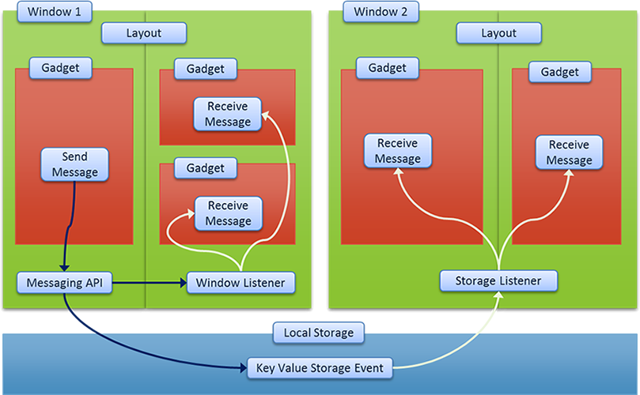

[About](../../../) - [Download](DOWNLOAD.md) - [Bootstrapping](BOOTSTRAPPING.md) - [Configure](CONFIGURE.md) - [Develop](DEVELOP.md) - Messaging - [Fullstack](FULLSTACK.md) - [Components](COMPONENTS.md)

# Cross window/gadget messaging API

*Zaz UI* uses HTML5 local storage event mechanism to cross communicate across child windows with main console. This allowed the API to be significantly smaller. The spec has been well adopted by all browsers.  

